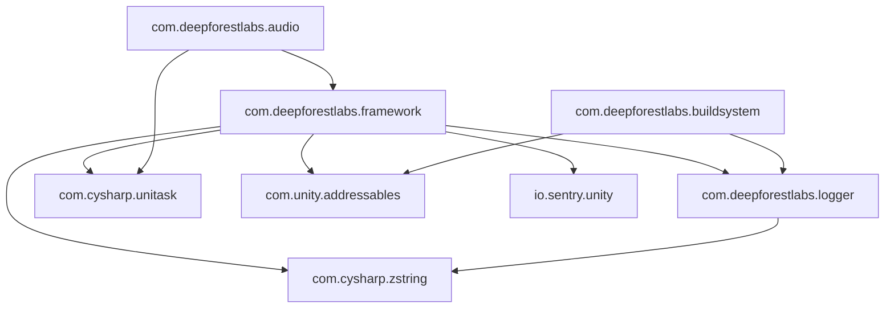
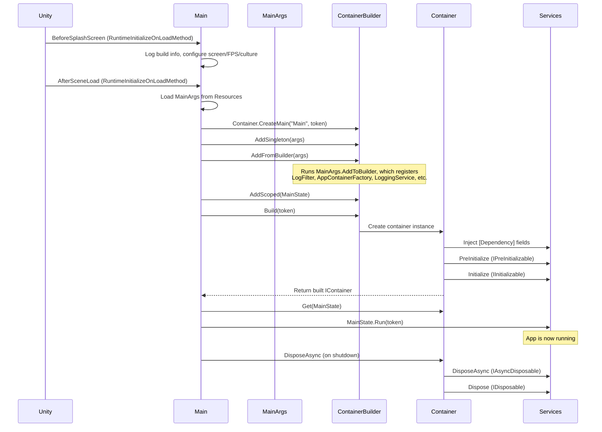

# Architecture

## Package Dependency Graph



- **Logger** has no DFL dependencies -- it only needs ZString for allocation-free formatting
- **Framework** depends on Logger and all external packages (UniTask, Addressables, Sentry)
- **Audio** depends on Framework (for DI, asset loading, and `AudioClipAssetRef`)
- **Build System** depends on Logger and Addressables but not on Framework (it's an editor-only build tool)

## Design Philosophy

### ScriptableObject-Driven Configuration

Configuration flows through `ScriptableObject` assets, not code constants. `ContainerBuilderFactory` subclasses use `[SerializeField]` fields to hold references to other assets, prefabs, and configuration data. This means:

- Designers can tune settings without touching code
- Different configurations can coexist as different assets (e.g. per-environment)
- Asset references are validated by Unity's serialization system

### Field-Injection DI

The framework uses attribute-based field injection rather than constructor injection. Fields marked with `[Dependency]` are set by the container after construction:

```csharp
public sealed class MyService : IInitializable
{
    [Dependency] private readonly IContainer _container = null!;
    [Dependency] private readonly IGameService _gameService = null!;
    [Dependency] private readonly SomeConfig? _optionalConfig = null; // nullable = optional
}
```

This pattern works well with Unity's constraints (MonoBehaviours can't have constructors, ScriptableObjects are created by Unity).

### Async Lifecycle

All lifecycle hooks are async (`UniTask`-based). `IInitializable.Initialize` receives a `CancellationToken` tied to the container's scope, so long-running init work (asset loading, network calls) can be cancelled cleanly when the scope disposes.

### Addressables-First Assets

Asset references are serializable `AssetRef` types that support both `Resources` and `Addressables` modes. The container handles loading, caching, and releasing -- consumers never call `Addressables.LoadAssetAsync` directly.

## Bootstrap Sequence



### Lifecycle Phases

1. **Registration** -- `IContainerBuilder` accumulates service registrations, asset downloads, and child scopes
2. **Build** -- loads factory assets, creates the container, instantiates scoped/singleton services
3. **Inject** -- walks all registered instances, sets `[Dependency]`-marked fields from the container
4. **PreInitialize** -- calls `IPreInitializable.PreInitialize()` (synchronous)
5. **Initialize** -- calls `IInitializable.Initialize(token)` (async, parallel where possible)
6. **Running** -- services are live; the container provides `Get<T>()` / `Find<T>()` resolution
7. **Dispose** -- `IAsyncDisposable.DisposeAsync()` then `IDisposable.Dispose()`, assets released, child scopes torn down

## Container Hierarchy

Containers form a parent-child tree. Resolution walks up from child to parent:

```
Main Container (singletons: BuildSettings, LogFilter, MainArgs)
  |
  +-- App Scope (scoped: GameService, AudioService, ...)
        |
        +-- Feature Scope (scoped: per-feature controllers, views)
```

- **Singletons** are shared across all scopes (registered once on the root or any ancestor)
- **Scoped** services are created once per scope and disposed with it
- **Transients** are created fresh on every `Get<T>()` or injection

Child scopes are created via `AddChild(ContainerFactory)` on the builder, which nests a new `ContainerBuilder` under the current one.

## Conventions

- **Nullable annotations**: all source files wrap with `#nullable enable` / `#nullable disable`
- **Optional injection**: declare a `[Dependency]` field as `T?` (nullable) and the container will skip it without error if the type isn't registered
- **Required injection**: non-nullable `[Dependency]` fields throw `DiException` if the type can't be resolved
- **Async patterns**: use `UniTask` everywhere, never `Task` or raw coroutines
- **Logging**: use `Log.Info/Warning/Error/Debug` from `DeepForestLabs.Logger`, never `Debug.Log` directly
